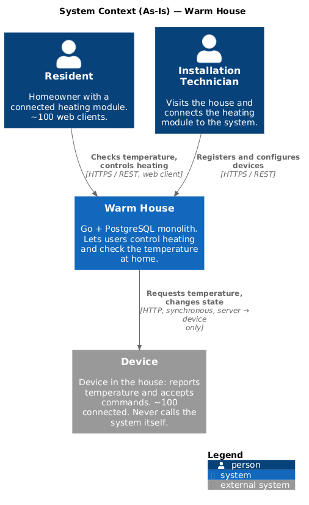
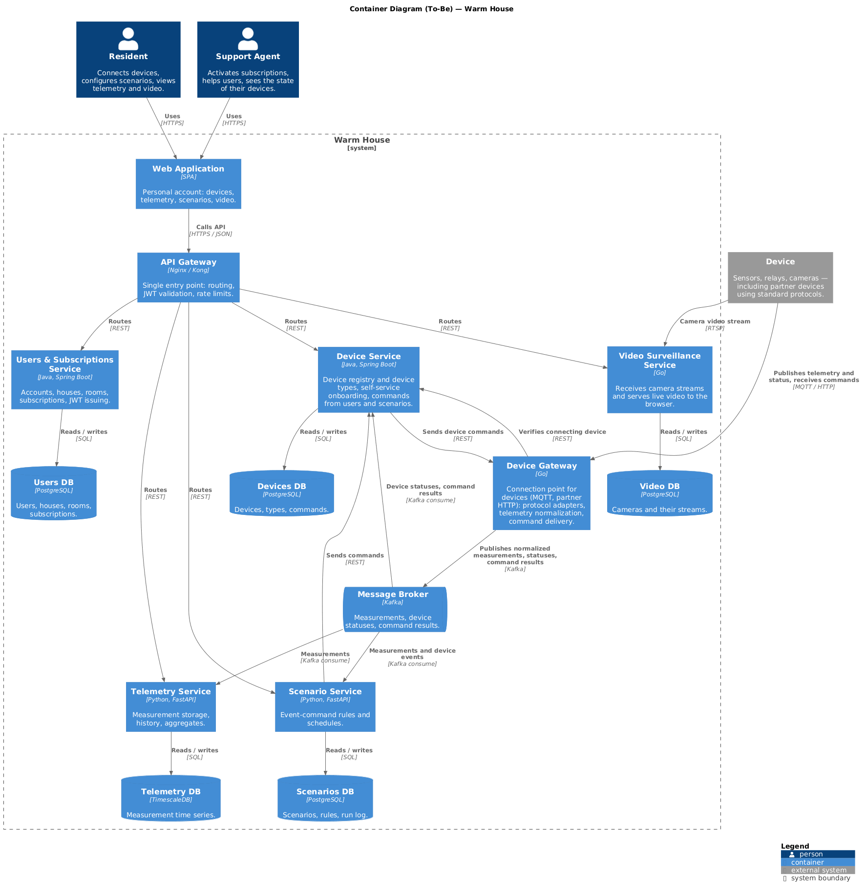
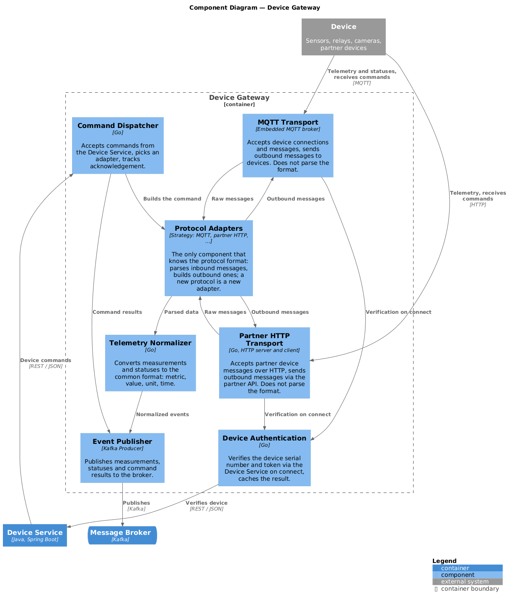
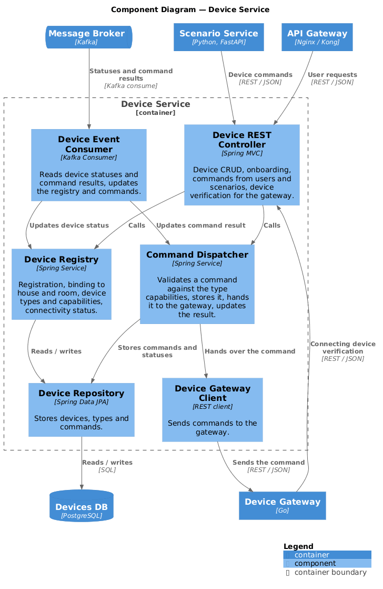
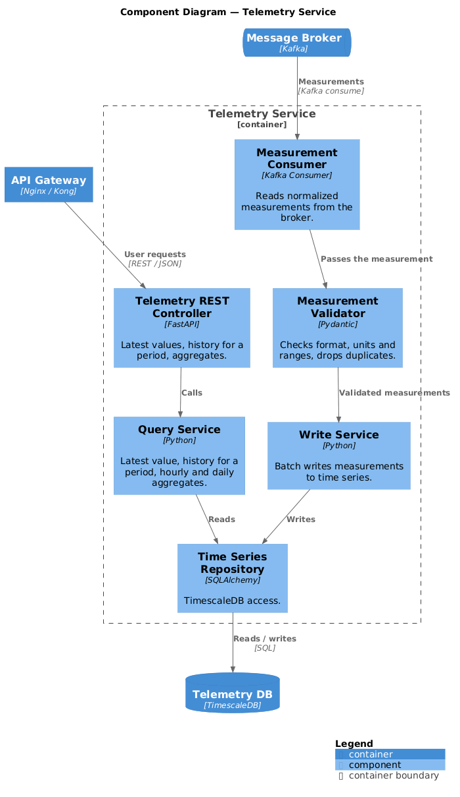
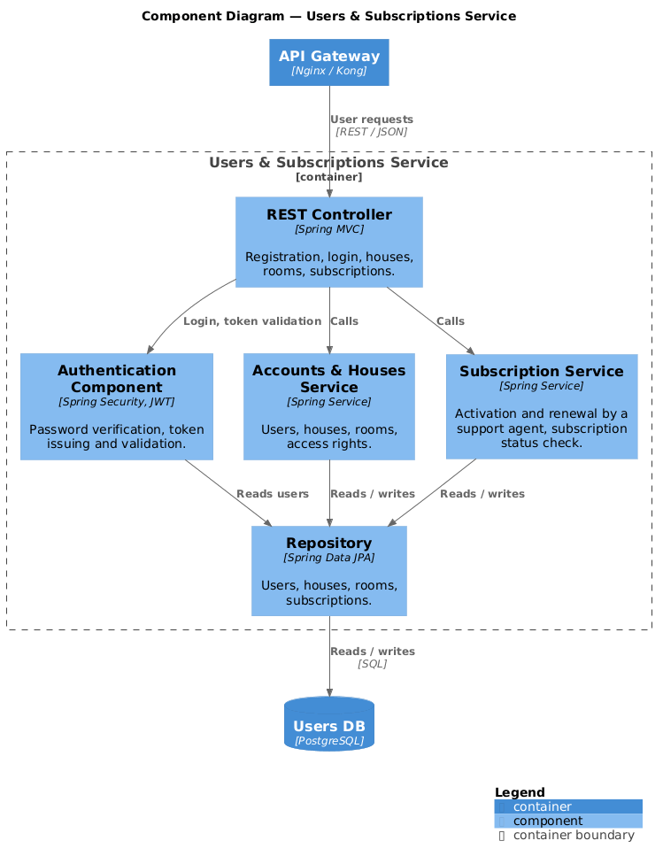
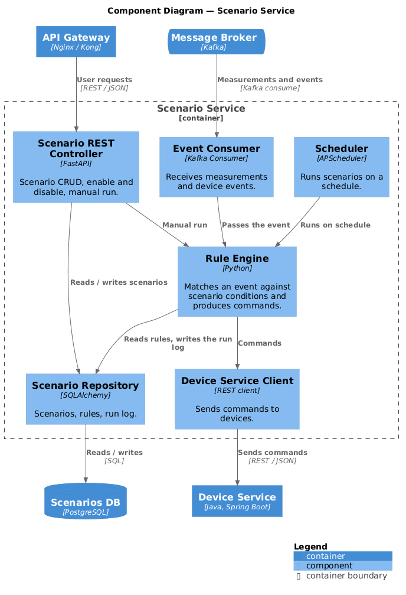
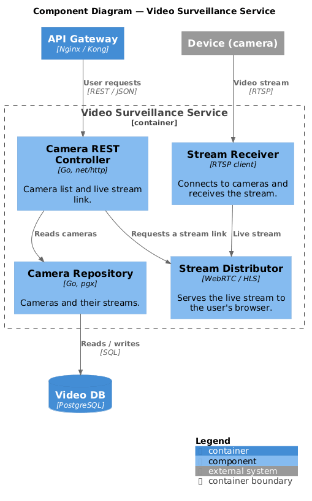
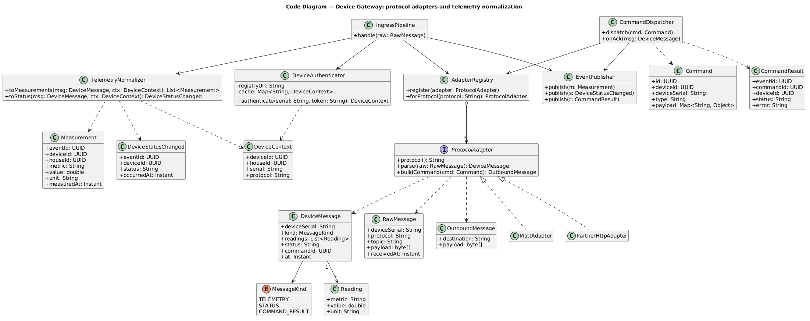
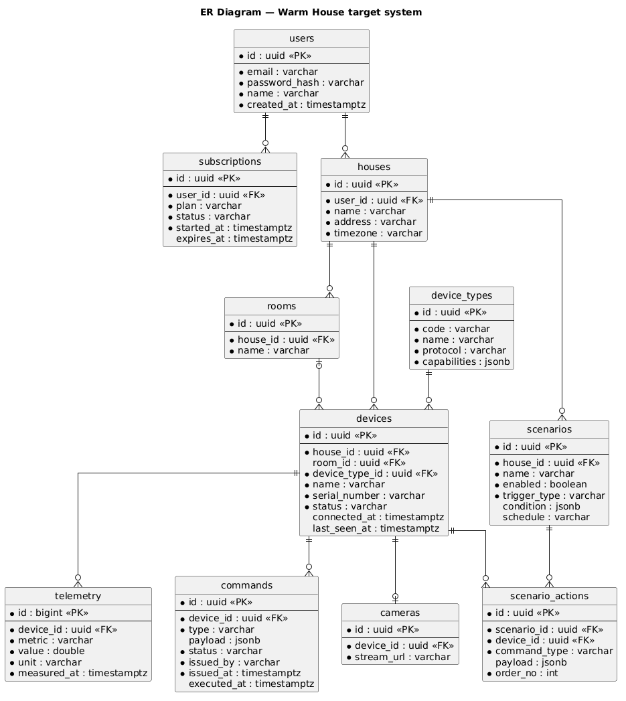

# Project_template

Это шаблон для решения проектной работы. Структура этого файла повторяет структуру заданий. Заполняйте его по мере работы над решением.

# Задание 1. Анализ и планирование

Чтобы составить документ с описанием текущей архитектуры приложения, можно часть информации взять из описания компании и условия задания. Это нормально.

**Управление отоплением:**

- По условию задания пользователи могут удалённо управлять отоплением в доме через веб-клиент; в текущем коде реализован только учёт датчиков температуры — управляющих команд устройству нет.
- Система поддерживает регистрацию, редактирование и удаление датчиков, которую выполняет специалист компании при выезде на объект.
- Система поддерживает только один тип устройства — датчик температуры — и одно направление взаимодействия: от сервера к устройству.

**Мониторинг температуры:**

- Пользователи могут просматривать текущую температуру по каждому датчику и по помещению.
- Система поддерживает получение температуры по запросу сервера к датчику в момент обращения пользователя.
- Система поддерживает хранение только последнего показания датчика без истории измерений.

### 2. Анализ архитектуры монолитного приложения

- Монолитное приложение на Go с REST/JSON API, в качестве СУБД используется PostgreSQL.
- Всё взаимодействие синхронное: веб-клиент обращается к монолиту, монолит — к базе данных и к датчикам; асинхронных вызовов, брокера сообщений и событий нет.
- Управление и сбор данных идут только от сервера к датчику, обратного канала от устройства к серверу нет.
- Код разделён на слои (HTTP-обработчики, сервис доступа к датчику, доступ к БД, модели), но связи между ними жёсткие — без интерфейсов, часть бизнес-логики находится в обработчиках.
- Тип датчика захардкожен в коде как константа с единственным значением «temperature», поэтому добавление нового типа устройства требует изменения и пересборки монолита.
- При каждом запросе списка датчиков монолит синхронно делает отдельный HTTP-запрос к внешнему сервису температуры на каждый датчик, то есть зависит от него при каждом обращении пользователя.
- Одна таблица датчиков в БД, сущностей «пользователь» и «дом» нет, аутентификация отсутствует.
- Приложение разворачивается как единый Docker-контейнер через docker-compose и масштабируется только целиком.

### **3. Определение доменов и границы контекстов**

В текущем монолите домены не выделены (одна таблица, один процесс); логически в нём два — управление отоплением и мониторинг температуры, причём «управление» в коде сводится к смене статуса датчика.

Домены целевой системы (To-Be):

- **Пользователи и подписки** — аккаунты, дома, активация подписки; меняется при изменении бизнес-модели.
- **Управление устройствами** — реестр, самостоятельное подключение, протоколы партнёров, команды устройствам (отопление, свет, ворота); меняется при появлении нового устройства партнёра, и это одно изменение задевает и подключение, и команды независимо от типа.
- **Телеметрия** — приём, хранение и выдача показаний; меняется, когда нужна другая аналитика, а не новые устройства.
- **Сценарии** — пользовательские правила «если событие — команда» и расписания; меняется, когда бизнес добавляет виды автоматизации.
- **Видеонаблюдение** — просмотр потока с камер; отдельно, потому что поток хранится и доставляется иначе, чем показания.

Каждый домен — свой ограниченный контекст со своей моделью данных и хранилищем; команды между контекстами синхронные, события — через брокер.

### **4. Проблемы монолитного решения**

- **Подключение только выездом специалиста** — в системе нет пользователей, домов и аутентификации, адрес устройств задан в конфигурации, поэтому самообслуживание по модели SaaS и подключение сотен домов в нескольких регионах невозможны.
- **Единственный тип устройства зашит в код** — добавление света, ворот, камер или устройства партнёра требует изменения и пересборки всего монолита, а вся команда из пяти разработчиков работает в одной кодовой базе с одним релизом.
- **Синхронный опрос устройств на каждый запрос** — при ста модулях один запрос пользователя порождает сто последовательных HTTP-вызовов к датчикам, время ответа растёт линейно с числом устройств, а один недоступный датчик замедляет ответ всем.
- **Нет обратного канала от устройства** — устройства не могут сами присылать показания и события, поэтому невозможны сценарии, уведомления и реакция на события в доме, а сервер должен иметь прямой доступ к каждому устройству за домашним интернет-каналом.
- **Нет истории показаний** — хранится только последнее значение, поэтому нельзя показать графики, аналитику и построить автоматизацию по истории.
- **Нет разделения данных между клиентами** — одна таблица датчиков без привязки к дому и владельцу не позволяет изолировать данные сотен клиентов и масштабировать систему по посёлкам и регионам.
- **Масштабирование и отказ только целиком** — нельзя отдельно масштабировать приём телеметрии и управление, любой сбой или обновление затрагивает всю систему, а жёсткие связи без интерфейсов и тестов затрудняют независимую проверку частей.

### 5. Визуализация контекста системы — диаграмма С4

Диаграмма контекста текущей (As-Is) системы: житель и специалист по подключению работают с монолитом «Тёплый дом», монолит сам опрашивает устройства в домах — обратного канала от них нет.



Исходник: [schemas/c4/01-context.puml](schemas/c4/01-context.puml)

# Задание 2. Проектирование микросервисной архитектуры

В этом задании вам нужно предоставить только диаграммы в модели C4. Мы не просим вас отдельно описывать получившиеся микросервисы и то, как вы определили взаимодействия между компонентами To-Be системы. Если вы правильно подготовите диаграммы C4, они и так это покажут.

**Диаграмма контейнеров (Containers)**

Целевая система: веб-приложение и API Gateway, пять микросервисов со своими базами данных, шлюз устройств и Kafka для событий. Устройства подключаются только к шлюзу — он разбирает протоколы, нормализует телеметрию и публикует её в брокер; сервис устройств хранит реестр и передаёт команды шлюзу. Команды между сервисами — синхронно по REST, показания и события устройств — асинхронно через брокер.



Исходник: [schemas/c4/02-containers.puml](schemas/c4/02-containers.puml)

**Диаграмма компонентов (Components)**

Шлюз устройств — точка подключения устройств: адаптеры протоколов, нормализация телеметрии, доставка команд:



Сервис устройств — реестр устройств и типов, подключение, команды от пользователя и сценариев, обновление статусов по событиям шлюза:



Сервис телеметрии — приём показаний только из брокера, валидация, хранение, история и агрегаты:



Сервис пользователей и подписок — регистрация, JWT, дома и помещения, подписка (активирует сотрудник поддержки):



Сервис сценариев — правила по событиям и расписанию, команды устройствам через сервис устройств:



Сервис видеонаблюдения — приём потоков с камер и раздача живого потока в браузер:



Исходники: [03-component-gateway.puml](schemas/c4/03-component-gateway.puml), [03-component-devices.puml](schemas/c4/03-component-devices.puml), [03-component-telemetry.puml](schemas/c4/03-component-telemetry.puml), [03-component-users.puml](schemas/c4/03-component-users.puml), [03-component-scenarios.puml](schemas/c4/03-component-scenarios.puml), [03-component-video.puml](schemas/c4/03-component-video.puml)

**Диаграмма кода (Code)**

Шлюз устройств: конвейер приёма сообщения (аутентификация → адаптер протокола → нормализация → публикация) и доставка команды. Новый протокол или тип устройства — новая реализация `ProtocolAdapter`, остальной код не меняется.



Исходник: [schemas/c4/04-code-gateway.puml](schemas/c4/04-code-gateway.puml)

# Задание 3. Разработка ER-диаграммы

Ключевые сущности целевой системы. Таблицы сгруппированы по владельцам: `users`, `subscriptions`, `houses`, `rooms` — сервис пользователей; `device_types`, `devices`, `commands` — сервис устройств; `telemetry` — сервис телеметрии; `scenarios`, `scenario_actions` — сервис сценариев; `cameras` — сервис видеонаблюдения. Связи между сервисами — по идентификаторам без внешних ключей на уровне БД.



Исходник: [schemas/er/er.puml](schemas/er/er.puml)

# Задание 4. Создание и документирование API

### 1. Тип API

Два типа взаимодействия:

- **REST (HTTP/JSON, OpenAPI)** — для запросов веб-клиента через API Gateway и для команд между сервисами (сценарии → устройства). Причины: запрос-ответ здесь естественен (пользователь ждёт результат), REST уже используется в монолите и понятен команде, легко тестируется в Postman и Swagger, не требует дополнительной инфраструктуры.
- **Асинхронные события через брокер (Kafka, AsyncAPI)** — для показаний и событий устройств. Причины: устройства сами присылают данные, а не опрашиваются сервером; телеметрия и сценарии читают один поток независимо друг от друга; недоступность одного потребителя не тормозит приём данных; при росте числа домов поток масштабируется партициями.

gRPC не выбран: потоковые и высоконагруженные вызовы между сервисами не нужны, а бинарный протокол усложнил бы отладку и тестирование для команды из пяти человек.

### 2. Документация API

OpenAPI 3.0 (открыть в [Swagger Editor](https://editor.swagger.io/)):

- [Сервис устройств](schemas/api/devices-openapi.yaml) — типы устройств, реестр, подключение, команды.
- [Шлюз устройств](schemas/api/gateway-openapi.yaml) — внутренний API: доставка команд, состояние подключения, приём телеметрии партнёров по HTTP.
- [Сервис телеметрии](schemas/api/telemetry-openapi.yaml) — последние значения, история, агрегаты.
- [Сервис пользователей и подписок](schemas/api/users-openapi.yaml) — регистрация, вход, дома с помещениями, подписка.
- [Сервис сценариев](schemas/api/scenarios-openapi.yaml) — сценарии и их ручной запуск.
- [Сервис видеонаблюдения](schemas/api/video-openapi.yaml) — камеры и живой поток.

AsyncAPI 2.6 (открыть в [AsyncAPI Studio](https://studio.asyncapi.com/)):

- [События через брокер](schemas/api/events-asyncapi.yaml) — каналы `telemetry.measurements`, `devices.status`, `devices.command-results`.

# Задание 5. Работа с docker и docker-compose

Перейдите в apps.

Там находится приложение-монолит для работы с датчиками температуры. В README.md описано как запустить решение.

Вам нужно:

1. сделать простое приложение temperature-api на любом удобном для вас языке программирования, которое при запросе /temperature?location= будет отдавать рандомное значение температуры.

Locations - название комнаты, sensorId - идентификатор названия комнаты

```
	// If no location is provided, use a default based on sensor ID
	if location == "" {
		switch sensorID {
		case "1":
			location = "Living Room"
		case "2":
			location = "Bedroom"
		case "3":
			location = "Kitchen"
		default:
			location = "Unknown"
		}
	}

	// If no sensor ID is provided, generate one based on location
	if sensorID == "" {
		switch location {
		case "Living Room":
			sensorID = "1"
		case "Bedroom":
			sensorID = "2"
		case "Kitchen":
			sensorID = "3"
		default:
			sensorID = "0"
		}
	}
```

1. Приложение следует упаковать в Docker и добавить в docker-compose. Порт по умолчанию должен быть 8081
2. Кроме того для smart_home приложения требуется база данных - добавьте в docker-compose файл настройки для запуска postgres с указанием скрипта инициализации ./smart_home/init.sql

Для проверки можно использовать Postman коллекцию smarthome-api.postman_collection.json и вызвать:

- Create Sensor
- Get All Sensors

Должно при каждом вызове отображаться разное значение температуры

Ревьюер будет проверять точно так же.

### Решение

**Что сделано**

- [apps/temperature-api](apps/temperature-api/) — сервис на Python 3.12 без внешних зависимостей: `GET /temperature?location=…&sensorId=…` и `GET /temperature/{sensorId}` отдают случайную температуру 18–26 °C; недостающий параметр подбирается по таблице `1 = Living Room, 2 = Bedroom, 3 = Kitchen`; формат ответа совпадает со структурой `TemperatureResponse` монолита. Упакован в Docker (`python:3.12-alpine`), порт 8081.
- [apps/docker-compose.yml](apps/docker-compose.yml) — добавлены сервисы `postgres` (`postgres:16-alpine`, `init.sql` монтируется в `/docker-entrypoint-initdb.d/`, healthcheck через `pg_isready`, том `postgres_data`) и `temperature-api` (сборка из `./temperature-api`, порт 8081). `POSTGRES_DB` намеренно не задан: базу `smarthome` создаёт сам `init.sql`.

**Запуск**

```bash
cd apps && docker compose up --build -d
```

**Проверка** по Postman-коллекции [apps/smarthome-api.postman_collection.json](apps/smarthome-api.postman_collection.json): Create Sensor вернул `{"id":1, …, "value":0, "status":"inactive"}`; три вызова Get All Sensors подряд вернули `value` 18.4, 24.1 и 20.6 при `status: "active"` — монолит при каждом запросе обращается к temperature-api. Таблица `sensors` создаётся скриптом инициализации при первом старте postgres.

# **Задание 6. Разработка MVP**

Необходимо создать новые микросервисы и обеспечить их интеграции с существующим монолитом для плавного перехода к микросервисной архитектуре.

### **Что нужно сделать**

1. Создайте новые микросервисы для управления телеметрией и устройствами (с простейшей логикой), которые будут интегрированы с существующим монолитным приложением. Каждый микросервис на своем ООП языке.
2. Обеспечьте взаимодействие между микросервисами и монолитом (при желании с помощью брокера сообщений), чтобы постепенно перенести функциональность из монолита в микросервисы.

В результате у вас должны быть созданы Dockerfiles и docker-compose для запуска микросервисов.

### Решение

**Микросервисы**

| Сервис | Стек | Порт | Что делает |
|---|---|---|---|
| [device-service](apps/device-service/) | Java 21, Spring Boot 3, PostgreSQL, Kafka | 8083 | Реестр устройств и их типов; команды с проверкой по возможностям типа (`202`, публикация в `devices.commands`); по показаниям из `telemetry.measurements` отмечает устройство `online`. |
| [telemetry-service](apps/telemetry-service/) | Python 3.12, FastAPI, PostgreSQL, Kafka | 8082 | Приём показаний **только** из Kafka (валидация, дедупликация по `eventId`); последние значения, история, агрегаты; совместимый с монолитом `GET /temperature/{sensorId}`. |

Языки — по условию задания (ООП, разные) и по диаграмме контейнеров. API сервисов соответствует [devices-openapi.yaml](schemas/api/devices-openapi.yaml) и [telemetry-openapi.yaml](schemas/api/telemetry-openapi.yaml), формат событий — [events-asyncapi.yaml](schemas/api/events-asyncapi.yaml). Юнит-тесты выполняются при сборке образов. Брокер — Kafka, один узел (KRaft).

**Интеграция с монолитом (strangler)**

- **Показания.** [temperature-api](apps/temperature-api/) имитирует устройство, которое само присылает данные: раз в 5 с публикует показания в Kafka, как это будет делать шлюз устройств; telemetry-service их сохраняет. Монолит **по умолчанию по-прежнему опрашивает temperature-api напрямую**, поэтому задание 5 работает без новых сервисов. Переход на сервис телеметрии — одной переменной, без правки кода монолита:

  ```bash
  cd apps && TEMPERATURE_API_URL=http://telemetry-service:8082 docker compose up -d app
  ```

- **Реестр.** При создании датчика монолит регистрирует его в device-service как `monolith-sensor-{id}` — единственная правка в коде монолита ([sensors.go](apps/smart_home/handlers/sensors.go), [device_registry.go](apps/smart_home/services/device_registry.go)). Вызов best-effort: при недоступности сервиса — запись в лог, ответ клиенту не меняется.
- В MVP идентификатор устройства в событиях — серийный номер; uuid появится вместе со шлюзом устройств.

**Запуск и проверка**

```bash
cd apps && docker compose up --build -d
```

Postman: папка «Task 6 - Microservices» в [коллекции](apps/smarthome-api.postman_collection.json). Результаты проверки: Create Sensor → `id: 1`, три вызова Get All Sensors → `24.4 / 19.8 / 19.4`; в логе монолита `Registered sensor 1 in device service as monolith-sensor-1`; `GET :8083/devices?houseId=00000000-0000-0000-0000-000000000001` → устройство `monolith-sensor-1` со статусом `online`; `GET :8082/temperature/1` → показание в формате монолита; команда `turn_on` модулю отопления → `202` и запись в `devices.commands`, `open` → `422`; после переключения `TEMPERATURE_API_URL` монолит отдаёт значения из telemetry-service, обновляющиеся каждые 5 с; при остановленном device-service Create Sensor → `201` с предупреждением в логе.

**План перехода к целевой системе**

1. Переключить чтение температуры на telemetry-service (переменная уже есть) — монолит перестаёт опрашивать устройства.
2. Перевести список датчиков на device-service; таблица `sensors` монолита становится кэшем, затем удаляется.
3. Заменить temperature-api шлюзом устройств: реальные устройства по MQTT/HTTP, uuid устройств в событиях.
4. Добавить сервис пользователей и API Gateway, веб-клиент ходит в новые сервисы; монолит выводится из эксплуатации.

